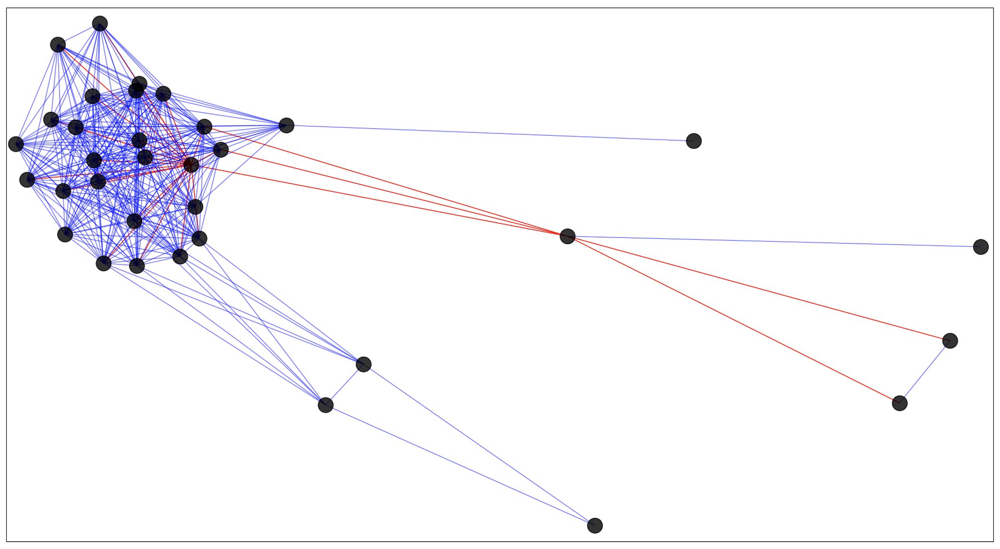
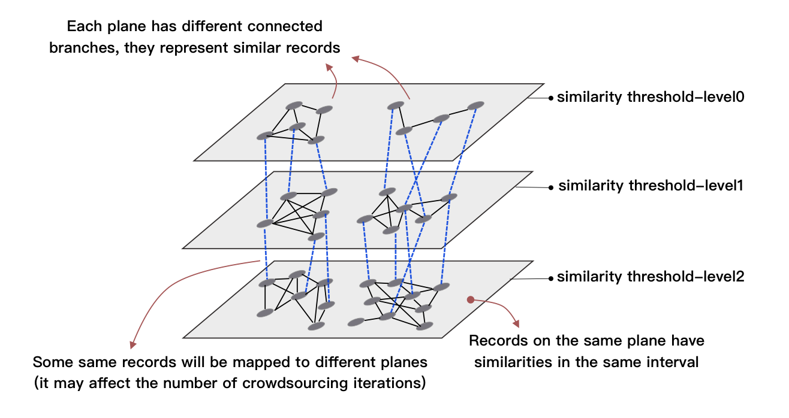

Verd
===

English | [简体中文](./README_CHN.md)

## Problem Description
Entity Resolution (ER) classifies records that reference the same real-world entities, which is an important part of the data cleaning field. In ER, identifying data records that are **similar in the database but represent different entities** is an important task in entity analysis.
About the technologies that rely on the combination of machine classification and crowdsourcing, the existing research is as follows:
- [Crowdsourcing algorithms for entity resolution(TransNode)](http://www.vldb.org/pvldb/vol7/p1071-vesdapunt.pdf)
- [Leveraging transitive relations for crowdsourced joins(TransM)](http://dbgroup.cs.tsinghua.edu.cn/wangjn/papers/sigmod2013-crowder-transitivity.pdf)
- [Crowder: Crowdsourcing entity resolution(CrowdER)](https://amplab.cs.berkeley.edu/wp-content/uploads/2012/06/crowder-vldb12.pdf)
- [Question selection for crowd entity resolution(GCER)](http://www.vldb.org/pvldb/vol6/p349-whang.pdf)
- [Crowd-Based Deduplication: An Adaptive Approach(ACD)](https://www.researchgate.net/profile/Sibo_Wang12/publication/300581099_Crowd-Based_Deduplication/links/58197fbd08aee7cdc685fde0.pdf?origin=publication_list)
- [Cost-Effective Crowdsourced Entity Resolution: A Partial-Order Approach(Power(+))](http://people.csail.mit.edu/dongdeng/papers/sigmod2016-partial-order.pdf)

Some methods turn the problem into a graph problem. Records are vertices, and the edges of two points represent the similarity of two points calculated by the similarity algorithm. By sending one or more sets of 'point-edge-point' records to crowdsourcing, the crowdsourced answer to whether the current pair is the same entity can be inferred as far as possible whether the surrounding points are adjacent entities.

Although the crowdsourcing method has high accuracy, it is expensive and slow. Therefore, the optimization goals of these existing methods are higher accuracy and fewer crowdsourcing iterations (referring to the number of crowdsourcing calls).), fewer crowdsourcing questions (referring to the total number of point-to-edge-point records sent to crowdsourcing each time).

## Simple Idea
When we analyze the relevant data set, we consider dividing different points into different similarity planes by similarity of reference machine recognition. Drawing the picture can find the following connected branches:

	

The vertices represent records, the edges between vertices represent whether they point to the same entity, the blue edges are yes, the red edges are no.

It can be found that vertices with more than two red edges have a high probability that the vertices around them do not point to the same vertex.Since there will be many similar connected branches in different planes, consider asking the crowdsourcing of each connected branch to infer the relationship between the other vertices. See [similarty_graph.py comment](./src/similarity_graph.py) for main algorithms.

	

## Experiment
Using the experimental dataset from ACD:
- [paper](http://www.cs.umass.edu/~mccallum/data/cora-refs.tar.gz)
- [product](http://dbs.uni-leipzig.de/Abt-Buy.zip)
- [restaurant](http://www.cs.utexas.edu/users/ml/riddle/data/restaurant.tar.gz)

Coding and calculating the F1-Measure indicator as follows:

	

