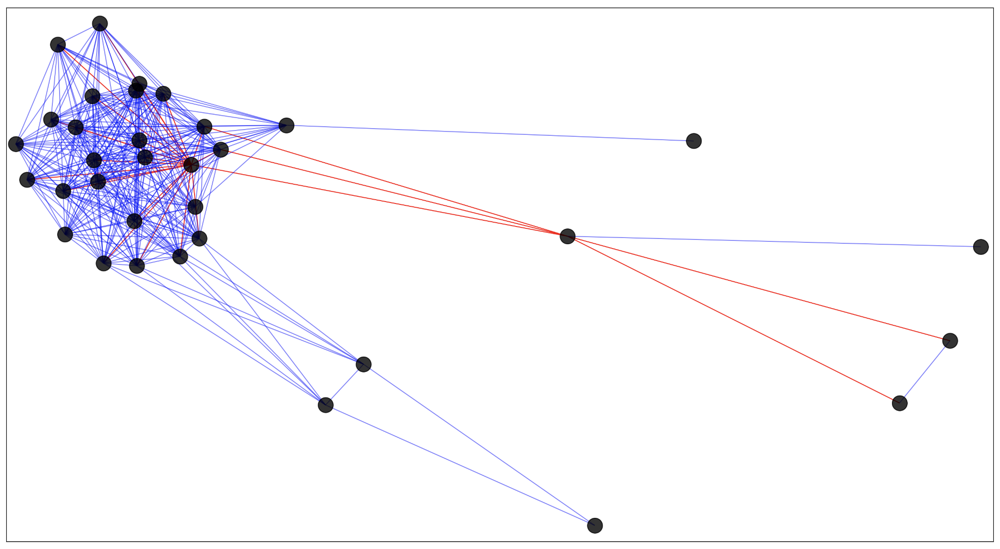
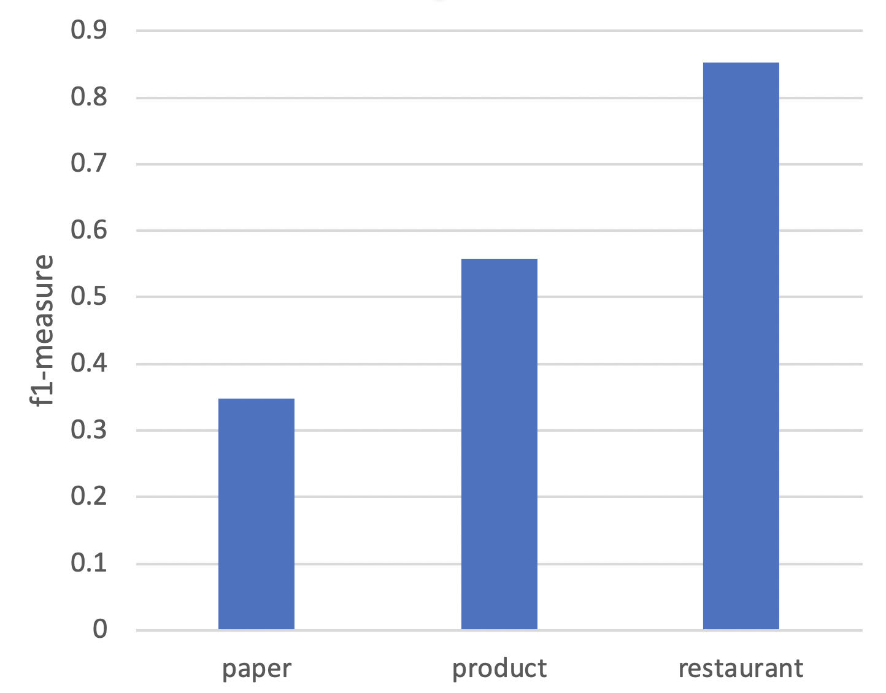

Verd
===

[English](./README.md) | 简体中文

## 问题描述
实体解析（Entity Resolution, ER）对引用了相同的真实世界实体的记录进行分类，是在数据清洗领域的重要一环。其中，识别数据库中**相似但代表不同实体**的数据记录是实体解析中一项重要的工作。
在依靠机器分类和众包相结合的技术中，现有部分研究如下：

- [Crowdsourcing algorithms for entity resolution(TransNode)](http://www.vldb.org/pvldb/vol7/p1071-vesdapunt.pdf)
- [Leveraging transitive relations for crowdsourced joins(TransM)](http://dbgroup.cs.tsinghua.edu.cn/wangjn/papers/sigmod2013-crowder-transitivity.pdf)
- [Crowder: Crowdsourcing entity resolution(CrowdER)](https://amplab.cs.berkeley.edu/wp-content/uploads/2012/06/crowder-vldb12.pdf)
- [Question selection for crowd entity resolution(GCER)](http://www.vldb.org/pvldb/vol6/p349-whang.pdf)
- [Crowd-Based Deduplication: An Adaptive Approach(ACD)](https://www.researchgate.net/profile/Sibo_Wang12/publication/300581099_Crowd-Based_Deduplication/links/58197fbd08aee7cdc685fde0.pdf?origin=publication_list)
- [Cost-Effective Crowdsourced Entity Resolution: A Partial-Order Approach(Power(+))](http://people.csail.mit.edu/dongdeng/papers/sigmod2016-partial-order.pdf)

部分方法将问题转化为图的形式，记录是其中的顶点，两点中相邻的边代表由相似度算法计算得到的两点相似性。通过将一组或多组‘点-边-点’的记录发送给众包，通过众包对当前对是否是同一实体的答案，尽可能推断出其周围的记录点是否为相邻实体。

虽然众包的方法精确度高，但相对于机器的方法来说昂贵且速度慢，因此这些现有方法的优化目标为较高的精度、较少的众包迭代次数（指调用众包的次数）、较少的众包提问数（指每次向众包发送‘点-边-点’记录对问题的总和）。

## 简单想法
在分析相关数据集时，考虑参考机器识别的相似度将不同的点划分在不同的相似度平面，绘制图片可以发现如下的连通分支：

	

其中，顶点代表记录，顶点间的边代表他们是否指向同一实体，蓝色边为是，红色边为否。

可以发现其中红色边超过两条的顶点大概率与周围的顶点都不指向相同顶点。由于在不同的平面中将会产生许多类似的连通分支，考虑通过对每个连通分支的众包提问以推断其中其它顶点间的关系。主要算法见 [similarty_graph.py 注释](./src/similarity_graph.py)。

	

## 实验验证
使用 ACD 中的实验数据集:
- [paper](http://www.cs.umass.edu/~mccallum/data/cora-refs.tar.gz)
- [product](http://dbs.uni-leipzig.de/Abt-Buy.zip)
- [restaurant](http://www.cs.utexas.edu/users/ml/riddle/data/restaurant.tar.gz)

编写验证代码，单计算 F1-Measure 指标如下图：

	

